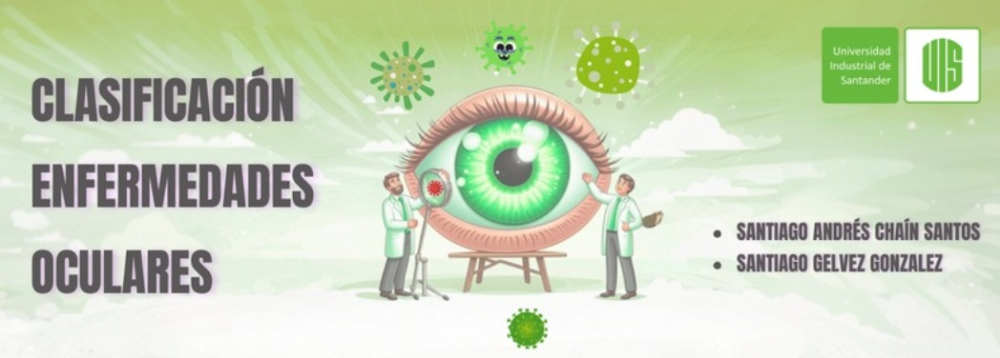

# Clasificacion-Ocular

Santiago Gelvez, Santiago Chain

# Objetivo
Desarrollar y evaluar un modelo de red neuronal convolucional (CNN) capaz de clasificar imágenes oculares en diferentes categorías de enfermedades.

# Dataset
Este es el link del dataset utilizado: https://www.kaggle.com/datasets/andrewmvd/ocular-disease-recognition-odir5k  
El dataset Ocular Disease Intelligent Recognition (ODIR) es una base de datos oftálmica estructurada que contiene información de 5,000 pacientes, incluyendo edad, fotografías de fondo de ojo a color de ambos ojos y palabras clave de diagnóstico de médicos. 
Este conjunto de datos representa información de pacientes recopilada por Shanggong Medical Technology Co., Ltd. de diferentes hospitales en China, usando cámaras de marcas como Canon, Zeiss y Kowa, lo que resulta en resoluciones de imagen variables. Las anotaciones fueron realizadas por lectores capacitados con control de calidad y clasifican a los pacientes en ocho categorías: 
Normal (N) 
Diabetes (D) 
Glaucoma (G) 
Cataratas (C) 
Degeneración Macular Relacionada con la Edad (A) 
Hipertensión (H) 
Miopía Patológica (M) 
Otras enfermedades/anomalías (O) 

# Modelos
Para la Densenet: 
•	Red Preentrenada: DenseNet (Weights de ImageNet). 
•	Capa de Adaptación: Pooling global (Global Average Pooling). 
•	Clasificación: Capa totalmente conectada (Fully Connected Layer). 
•	Optimización: Adam con tasa de aprendizaje ajustable. 
•	Técnicas de Mejora: Transfer learning, balanceo de clases, aumento de datos. 
•	Precisión Numérica: FP16 para optimización en GPU. 

# Enlaces
